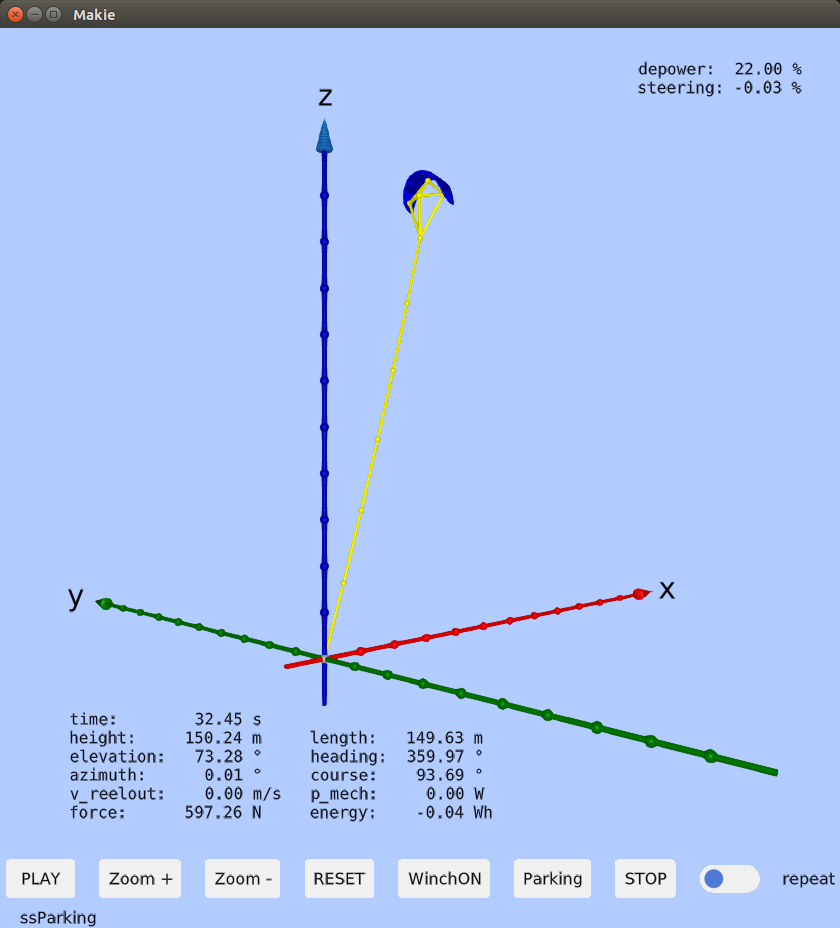

# KiteSimulators

Meta-package, providing "Julia Kite Power Tools", consisting of the following packages:
<p align="center"></p>

## Hardware requirements
A fast computer helps to reduce the installation time, otherwise it works well even on dual core computers
with 4G RAM, even 2G RAM might be sufficient. OpenGL is a hard requirement. A dedicated graphics card is useful, 
but not always required. If you have a Windows laptop please enable the dedicated graphics card in the settings.
The program was tested with a Logitech Extreme 3D pro Joystick, but most likely any Joystick will do. If not, please create an issue on Github. The installation was tested on Windows 10 and Ubuntu 18.04 and 20.04, but should also work
on Mac.

## Installation
If you do not have Julia installed yet, please read [Installation](docs/Installation.md).

For the installation of this package, please read [Installation of KiteSimulators](docs/PackageInstallation.md)

## Copy and run an example
From the Julia prompt execute:
```julia
using KiteSimulators
cp_examples()
```
If you have a Joystick connected, you can run the simulator with joystick control
```julia
./bin/run_julia or bin\run_julia

using KiteSimulators
include("examples/joystick.jl")  # Linux
include("examples\\joystick.jl") # Windows
```
You should now see the kite attached to the tether:
<p align="center"></p>


To view and modify the example, you can use the command:
```julia
edit("examples/joystick.jl")  # Linux
edit("examples\\joystick.jl") # Windows
```
The x axis of the Joystick controls steering. By pressing the joystick forward you can depower the kite.

Button 3 starts the reel-out, button 4 the reelin, and button 5 switches to parking mode. With button one you can start the simulation, with button two you can stop it.

If you don't have a Joystick, try the following example:

```julia
./bin/run_julia or bin\run_julia

using KiteSimulators
include("examples/autopilot.jl")  # Linux
include("examples\\autopilot.jl") # Windows
```
You should see that the autopilot starts at 10s and that it is controlling the full power cycle, kite and winch. 

## Documentation
- First example, explained: [First Example](docs/first_example.md).  
- Reading and writing log files: [Logging](docs/logging.md)
- Plotting results in 2D:  [Plotting](docs/plotting.md)

Most of the packages have their own documentation. See for example:
- [KiteModels](https://ufechner7.github.io/KiteModels.jl/dev/)
- [KiteUtils](https://ufechner7.github.io/KiteUtils.jl/stable/)

and the README files of the other packages, listed below.

## See also
- [Research Fechner](https://research.tudelft.nl/en/publications/?search=wind+Fechner&pageSize=50&ordering=rating&descending=true) for the scientic background of this code
- the packages [KiteControllers](https://github.com/aenarete/KiteControllers.jl) and [KiteViewers](https://github.com/aenarete/KiteViewers.jl)
- The packages [KiteModels](https://github.com/ufechner7/KiteModels.jl) and [WinchModels](https://github.com/aenarete/WinchModels.jl) and [KitePodModels](https://github.com/aenarete/KitePodModels.jl) and [AtmosphericModels](https://github.com/aenarete/AtmosphericModels.jl)
- the package [KiteUtils](https://github.com/ufechner7/KiteUtils.jl) 
