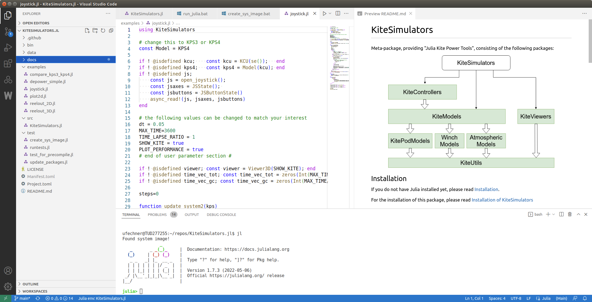

## Installation of Julia

### Windows
Please download and install Julia as explained at https://julialang.org/downloads/ .
Choose the 64-bit (installer). Make sure to check the option "Add julia to path" when running the installer.

### Linux

Copy and past the following line to install the latest stable version of Julia:
```
bash -ci "$(curl -fsSL https://raw.githubusercontent.com/abelsiqueira/jill/master/jill.sh)"
```
If you want to be able to easily switch between different versions of Julia consider to install
the Python version of jill, see https://github.com/johnnychen94/jill.py
```bash
pip install jill
jill install
```
It is suggested to add the following line to your ```.bashrc``` file:
```
alias jl='./bin/run_julia'
```
This makes it possible to run julia with the shortcut `jl` later.

### Mac
Please download and install Julia as explained at https://julialang.org/downloads/

The jill installers will most likely also work on Mac and allow eays switching of different Julia versions (see Linux section).

Continue with [README](../README.md)

## Installation of the IDE VSCode
It is useful to install the integrated development environment VSCode, even though it is not
required. You can also use any editor of your choice. 

VSCode provides syntax highlighting, but also the feature "goto definition" which can help to understand
and explore the code. 

<p align="center"></p>

You can download and install VSCode for all operating systems from this location: https://code.visualstudio.com/


Julia development with VSCode is well documented here: https://www.julia-vscode.org/docs/stable/

I would NOT use all the advanced features of julia-vscode, I prefer to just use the vscode terminal and launch julia
from the terminal. This makes it easy to launch Julia with any command line options and also to start
and restart Julia quickly.