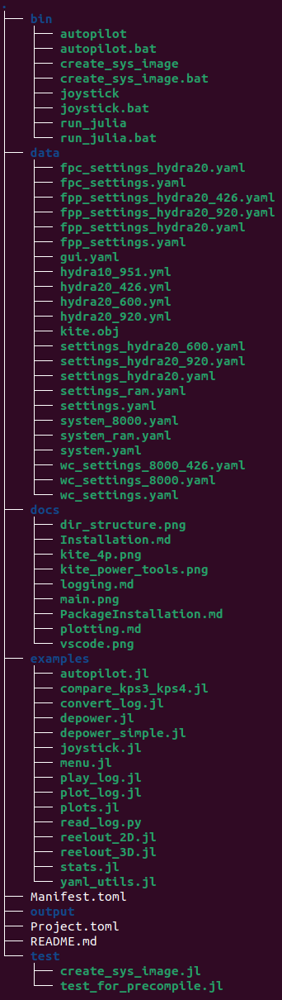

## Installation of Julia Kite Power Tools

On Linux, it is suggested to first install the plotting Library `Matplotlib`, for example on Ubuntu with this command:
```bash
sudo apt install python3-matplotlib
```
This is not needed on Windows.

It is suggested that you create a folder for your kite simulators.
```bash
mkdir kitesims
cd kitesims
julia --project="."
```
On the Julia prompt install the package:
```julia
using Pkg
pkg"add KiteSimulators"
pkg"add ControlPlots"
pkg"add Timers"

using KiteSimulators
init_project()
exit()
```
#### Tips
- Connect your laptop to a power socket before installing these packages.
- If you get an error, you might have to download and install https://aka.ms/vs/17/release/vc_redist.x64.exe first and try again.

The commands above create the following directory structure:

<p align="center"></p>

It is suggested that you now create a Julia image that contains a compiled version of all the packages.

On the command line, enter for Linux:
```bash
cd bin
./create_sys_image
```
and for Windows, using the "Windows command prompt":
```bash
cd bin
create_sys_image
```
This will take 10 to 30 minutes but is only required once.

### Running the KiteApp
You can now run the KiteApp with the command:
```
autopilot
```
from the `bin` folder. Alternatively, you can start it with a double-click on the file `autopilot.bat`
in the `bin` folder.

On Linux, you need to type:
```
./autopilot
```

### Execute the Julia REPL
To execute Julia on Linux with the commands:
```bash
cd ..
./bin/run_julia
```
and on Windows:
```bash
bin\run_julia
```

To quit the Julia REPL, type \<CTRL\>\<d\> .

Continue with [README](../README.md)
