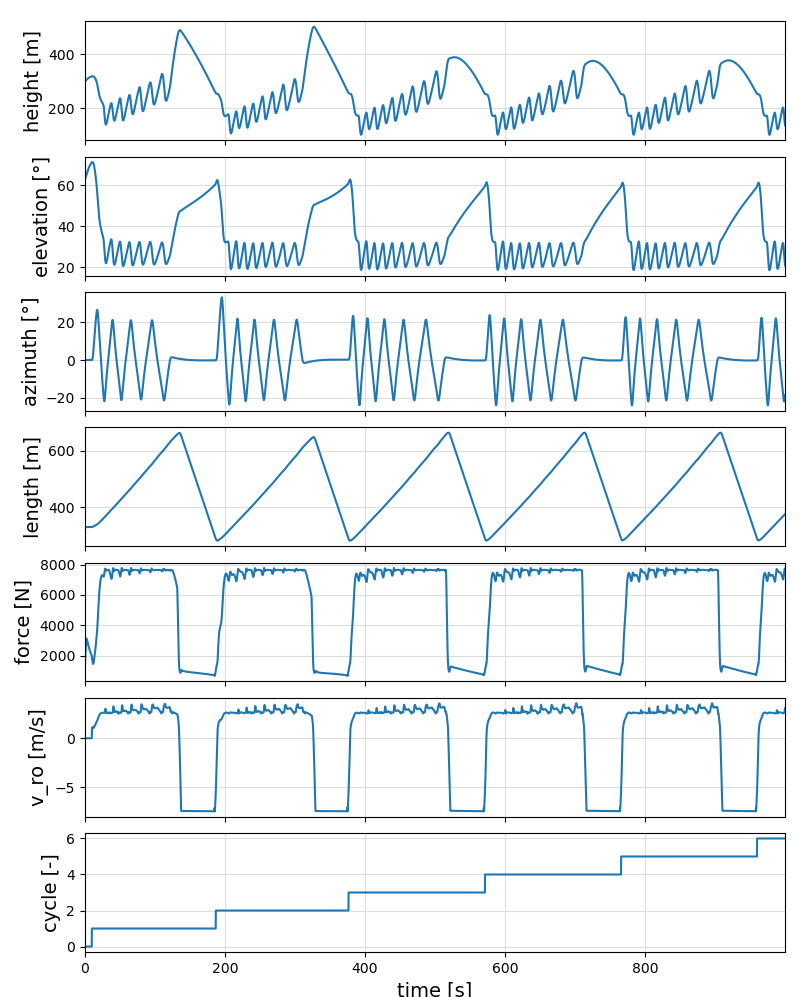

## Plotting results in 2D

If you have created a log file of a simulation, you can plot the result using the following commands:

```julia
include("examples/plot_log.jl")  # Linux
include("examples\\plot_log.jl") # Windows
```

You can save the plot using the following command:
```julia
plt.savefig("output/main.png")
```
<p align="center"></p>

There are many predefined plotting functions. If they are not sufficient for your needs, create a copy of plot_log.jl and modify this file as required.


Continue with [README](../README.md)